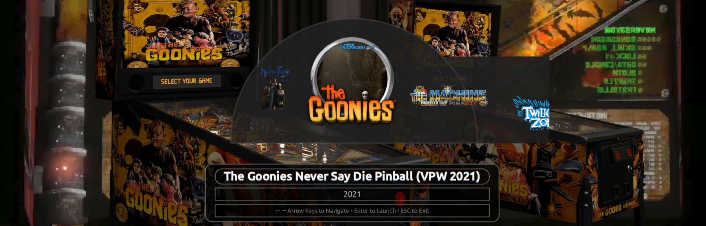
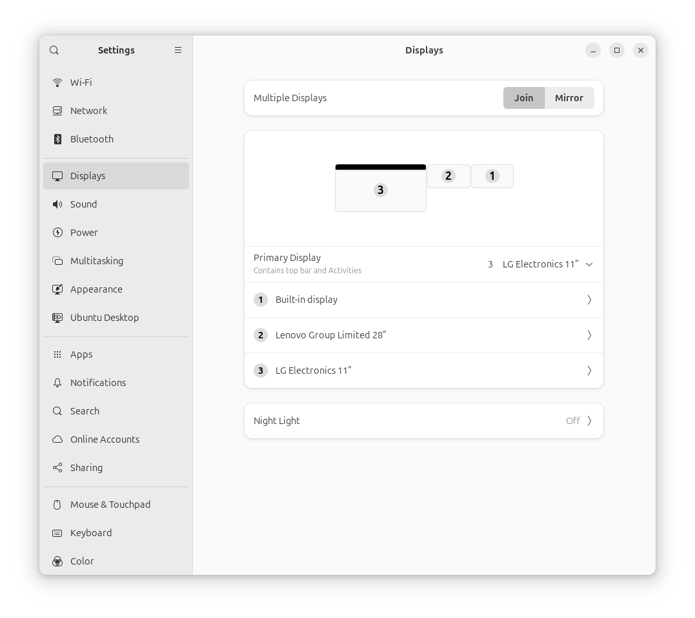

# PinballUX

A Visual Pinball frontend for Linux with multi-monitor support, inspired by PinballX.

## Features

- **Multi-Monitor Support**: Playfield, Backglass, DMD, FullDMD, and Topper displays
- **VPX Compatibility**: Works with Visual Pinball Standalone for Linux
- **Media Integration**: Video previews, table images, and audio support
- **Input Handling**: Keyboard and joystick/gamepad support
- **Resolution Scaling**: Adaptive layouts for different monitor configurations
- **Table Management**: Database-driven table organization with metadata

## Requirements

- Python 3.8+
- PyQt6
- Visual Pinball Standalone for Linux
- Linux with X11 or Wayland

## Installation

1. Clone the repository:
```bash
git clone https://github.com/keithbphillips/PinballUX.git
cd PinballUX
```

2. Install Visual Pinball Standalone for Linux:
   - Download Visual Pinball Standalone for Linux from [GitHub Releases](https://github.com/vpinball/vpinball/releases)
   - Extract the VPinball directory into the PinballUX root directory as `vpinball/`
   - The structure should look like: `PinballUX/vpinball/VPinballX_GL`
   - Place ROM files in `PinballUX/roms/` directory

3. Set up Python virtual environment:
```bash
python -m venv .venv
source .venv/bin/activate
```

4. Install Python dependencies:
```bash
pip install -r requirements.txt
```

5. Add your VPX table files to `pinballux/data/tables/`

## Ubuntu Display Configuration

**IMPORTANT**: Before running PinballUX, you must configure your Ubuntu display settings correctly for multi-monitor support to work properly.



### Display Configuration Requirements:

1. **Primary Display**: Set your **Playfield monitor** as the Primary Display in Ubuntu Settings
2. **Horizontal Arrangement**: Arrange all displays horizontally (left-to-right)
3. **Top Alignment**: Align all displays to the top edge

PinballUX relies on Ubuntu's display configuration and screen numbering. The application will detect screens in the order Ubuntu assigns them (0, 1, 2, etc.) and position windows accordingly.

### Configuration File

Edit `~/.config/pinballux/config.json` to map each display type to the correct screen number:

```json
"displays": {
  "playfield": {
    "screen_number": 3,
    "dmd_mode": "full"
  },
  "backglass": {
    "screen_number": 2,
    "dmd_mode": "full"
  },
  "dmd": {
    "screen_number": 1,
    "dmd_mode": "native"
  }
}
```

- **screen_number**: Which physical screen (0-based index) for this display
- **dmd_mode**: `"native"` (original size) or `"full"` (scaled to screen)

Resolution changes are automatically detected on application restart.

## Usage

Run PinballUX:
```bash
python run_pinballux.py
```

### Keyboard Controls

- **← / →** (Left/Right Arrow Keys): Navigate through the table wheel
- **Enter**: Launch selected table
- **R**: Rotate display 90° clockwise (useful for portrait/landscape orientation)
- **Escape**: Exit PinballUX

## Media Files

PinballUX uses a structured media system where files must match the table name and be placed in the appropriate directory:

### Media Directory Structure

```
pinballux/data/media/
├── videos/
│   ├── table/          # Table gameplay videos
│   ├── backglass/      # Backglass videos
│   ├── dmd/            # DMD videos
│   ├── real_dmd/       # Real DMD capture videos
│   ├── real_dmd_color/ # Color DMD videos
│   └── topper/         # Topper videos
├── images/
│   ├── table/          # Table playfield images
│   ├── backglass/      # Backglass images
│   ├── wheel/          # Wheel images for table selection
│   └── dmd/            # DMD images
└── audio/
    ├── launch/         # Table launch audio
    └── ui/             # UI sound effects
```

### Media File Naming Convention

Media files must match the table name exactly. For example, for a table named "My Favorite Table.vpx":

- **Table video**: `My Favorite Table.mp4` → `pinballux/data/media/videos/table/`
- **Backglass video**: `My Favorite Table.mp4` → `pinballux/data/media/videos/backglass/`
- **DMD video**: `My Favorite Table.mp4` → `pinballux/data/media/videos/real_dmd_color/`
- **Wheel image**: `My Favorite Table.png` → `pinballux/data/media/images/wheel/`
- **Launch audio**: `My Favorite Table.mp3` → `pinballux/data/media/audio/launch/`

### Media Playback Priority

PinballUX displays media in the following priority order for each display type:

1. **Video** (if available) - preferred format: MP4, F4V
2. **Image** (if video not found) - preferred format: PNG, JPG
3. **Default content** (if no media found) - fallback display

This applies to:
- **Playfield display**: Table video → Table image → Default background
- **Backglass display**: Backglass video → Backglass image → Table name display
- **DMD display**: DMD video → DMD image → Text display

## Configuration

Configuration files are stored in `~/.config/pinballux/`:
- `config.json`: Main configuration file
- `pinballux.db`: Table database
- `logs/`: Application logs

## Project Structure

```
pinballux/
├── src/
│   ├── core/           # Core application components
│   ├── ui/             # User interface components
│   ├── database/       # Table database management
│   ├── media/          # Media handling (video, audio, images)
│   ├── input/          # Input handling (keyboard, joystick)
│   ├── displays/       # Multi-monitor display management
│   └── main.py         # Application entry point
├── config/             # Configuration files
├── data/               # Application data
│   ├── tables/         # VPX table files
│   └── media/          # Media files (images, videos, audio)
├── tests/              # Unit tests
└── docs/               # Documentation
```

## Development Status

This project is in early development. Core features are being implemented in phases:

1. ✅ Project structure and configuration system
2. 🚧 Multi-monitor architecture and display management
3. 📋 Table database and VPX launching
4. 📋 Media system and user interface
5. 📋 Input handling and themes

## Contributing

This is an open source project. Contributions are welcome!

## License

MIT License - see LICENSE file for details.