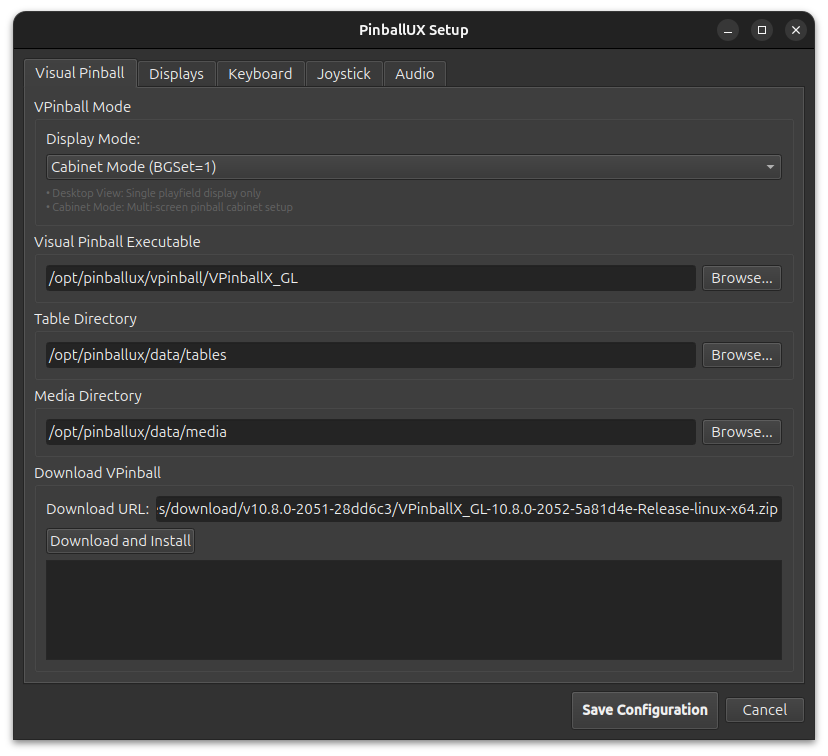
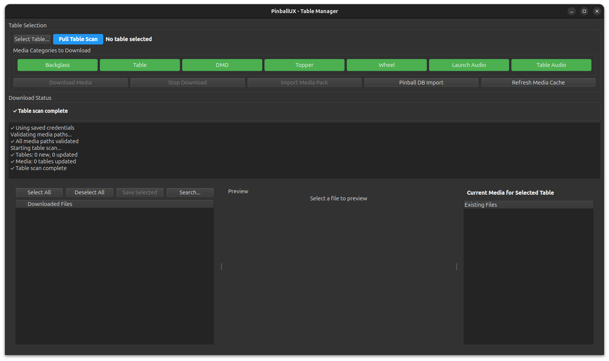
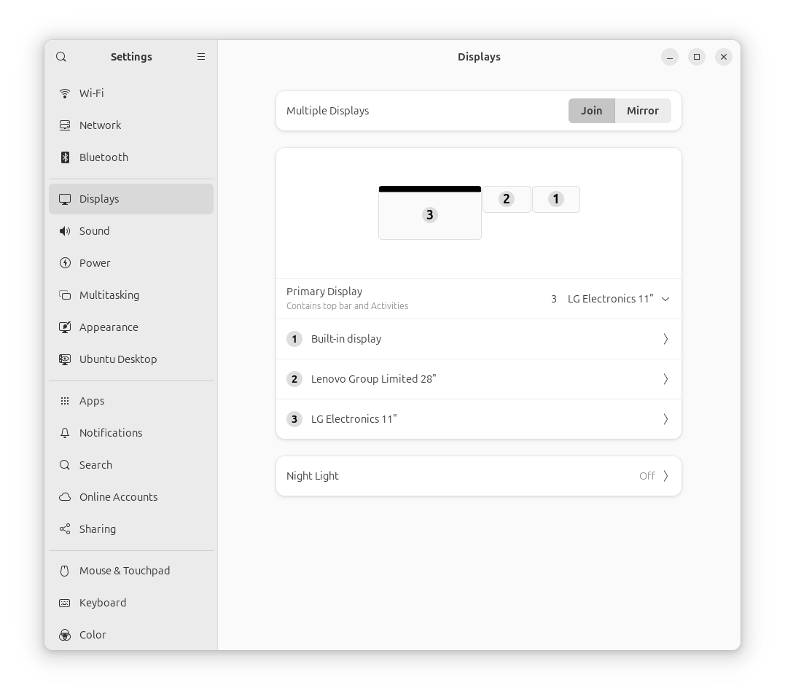

# PinballUX

A Visual Pinball frontend for Linux with multi-monitor support, inspired by PinballX.

**Tested on**: Ubuntu 24.04.3 LTS | Intel i7 | NVIDIA GTX 1660

## Screenshots

### Setup GUI


### Table Manager


## Features

- **Multi-Monitor Support**: Playfield, Backglass, DMD, FullDMD, and Topper displays
- **VPX Compatibility**: Works with Visual Pinball Standalone for Linux
- **Media Integration**: Video previews, table images, and audio support
- **Input Handling**: Keyboard and joystick/gamepad support
- **Resolution Scaling**: Adaptive layouts for different monitor configurations
- **Table Management**: Database-driven table organization with metadata

## Requirements

- Python 3.8+
- PyQt6
- Visual Pinball Standalone for Linux
- Linux with X11 or Wayland

## Installation

### Quick Install (Ubuntu 24.04 LTS)

**Download and install the .deb package:**

```bash
# Download the latest package and installer
wget https://github.com/keithbphillips/PinballUX/releases/latest/download/pinballux_0.6.0-1_all.deb
wget https://raw.githubusercontent.com/keithbphillips/PinballUX/main/install.sh
chmod +x install.sh

# Run the installer (handles dependencies automatically)
./install.sh
```

Or install manually:
```bash
# Using gdebi (recommended — handles dependencies automatically)
sudo apt install gdebi-core
sudo gdebi pinballux_0.6.0-1_all.deb

# Or using dpkg + apt
sudo dpkg -i pinballux_0.6.0-1_all.deb
sudo apt-get install -f -y
```

Then run `pinballux-setup` to configure and get started!

See [INSTALL.md](INSTALL.md) for detailed installation instructions.

### Install from Source

1. Install required system libraries:
```bash
sudo apt install \
    libxcb-cursor0 \
    python3-venv \
    python3-pyqt6 \
    python3-pyqt6.qtmultimedia \
    python3-pygame \
    gstreamer1.0-plugins-good \
    gstreamer1.0-plugins-bad \
    gstreamer1.0-libav \
    gstreamer1.0-gl \
    gstreamer1.0-qt6
```

2. Clone the repository:
```bash
git clone https://github.com/keithbphillips/PinballUX.git
cd PinballUX
```

3. Create and activate a Python virtual environment with access to system packages:
```bash
python3 -m venv --system-site-packages .venv
source .venv/bin/activate
```

   > **Why `--system-site-packages`?** PyQt6 multimedia requires GStreamer plugins that are
   > only available through system packages. Using `--system-site-packages` lets the venv
   > use the system-installed `python3-pyqt6` and `python3-pyqt6.qtmultimedia` packages,
   > which are already linked against the system GStreamer stack.

4. Install remaining Python dependencies:
```bash
pip install -r requirements.txt
```

5. Add your VPX table files to `pinballux/data/tables/`

6. Install Visual Pinball Standalone for Linux:

   **Option A: Automated Installation (Recommended)**
   - Run the Setup GUI (step 7 below) — the Visual Pinball tab has a "Download and Install" button
   - VPinball will be downloaded, extracted, and configured automatically

   **Option B: Manual Installation**
   - Download Visual Pinball Standalone for Linux from [GitHub Releases](https://github.com/vpinball/vpinball/releases)
   - Extract into `vpinball/` inside the project root:
   ```bash
   mkdir vpinball
   unzip /path/to/VPinballX_GL-*.zip -d vpinball/
   # If the release is a zip-of-tar:
   # cd vpinball && tar -xvf VPinballX_GL-*.tar && cd ..
   ```
   - The executable should end up at `vpinball/VPinballX_GL`

   **ROM Files**: Place ROM files in `pinballux/data/roms/`

7. **Configure PinballUX** — run the Setup GUI to configure displays, input, and VPX paths:
```bash
python setup_gui.py
```

   See the [Setup GUI](#setup-gui) section below for details.

8. **Run Table Manager** — scan tables and download media:
```bash
python table_manager.py
```

   See the [Table Manager](#table-manager) section below for details.

9. **Launch PinballUX**:
```bash
python run_pinballux.py
# Or use the convenience launcher:
bash launch_pinballux.sh
```

## Setup GUI

The Setup GUI provides a user-friendly interface for configuring all aspects of PinballUX.

### Running Setup GUI

```bash
# .deb install
pinballux-setup

# Source install
python setup_gui.py
```

### Configuration Tabs

**Displays Tab**
- Configure each display type (Playfield, Backglass, DMD, FullDMD, Topper)
- Set screen numbers for multi-monitor setups
- Choose rotation (0°, 90°, 180°, 270°)
- Select DMD mode (Full Screen or Native Size)
- Enable/disable individual displays

**Visual Pinball Tab**
- Set Visual Pinball executable path
- Configure table directory
- Configure media directory
- **Download VPinball**: Automatically download and install VPinball from GitHub releases
  - Pre-populated download URL (can be updated to latest release)
  - Downloads, extracts zip and tar files automatically
  - Installs to `vpinball/` directory in project root
  - Automatically updates executable path after installation

**Keyboard Tab**
- Map keyboard keys for navigation
- Configure Exit, Select, Up, Down, Left, Right actions
- Click buttons and press keys to capture input

**Joystick Tab**
- Enable/disable joystick input
- Map joystick buttons for frontend navigation
- Map gameplay buttons (flippers, plunger, start, menu, MagnaSave, exit)
- Automatically detects connected joysticks
- Click buttons and press joystick buttons to capture input

**Audio Tab**
- Enable/disable table audio playback during navigation

### Features

- **Live Key/Button Capture**: Click any button and press the desired key or joystick button to map it
- **Joystick Detection**: Automatically detects and displays connected joystick information
- **Path Browsing**: Browse for VPX executable and directories with file dialogs
- **Config Validation**: Validates settings before saving
- **Single Config File**: All settings saved to `~/.config/pinballux/config.json`

## Table Manager

The Table Manager is a PyQt6 GUI application that handles table scanning, media management, FTP downloads from ftp.gameex.com, and database import from pinballnirvana.com.

### Running Table Manager

```bash
# .deb install
pinballux-manager

# Source install
python table_manager.py
```

On startup, the Table Manager will automatically:
- Scan for new VPX table files in `pinballux/data/tables/`
- Update the database with any changes
- Scan for media files
- Display a completion popup

### Downloading Media from FTP

The Table Manager can download media files (backglass, DMD, table videos/images, wheel images, and audio) from ftp.gameex.com:

1. **Select Table**: Click "Select Table..." to choose a table from your database
2. **Enter Credentials**: On first use, you'll be prompted for FTP credentials (saved for future sessions)
3. **Download Media**: Click "Download Media" to fetch all available media for the selected table
4. **Review Downloads**: Downloaded files appear in the left panel, organized by media type with icons:
   - 🎬 Video files
   - 🖼️ Image files
   - 🔊 Audio files
5. **Preview Files**: Click any downloaded file to preview it in the preview pane
6. **Save Files**: Click "Save" next to a file to copy it to your PinballUX media directory (prompts before overwriting)

### Manual Media Search

For tables where automatic FTP matching doesn't work, use the **Search** feature:

1. **Select Table**: Choose a table from your database
2. **Click Search**: Opens a search dialog
3. **Enter Search Term**: Type keywords to search for on the FTP server (e.g., table name variations)
4. **Select Files**: Choose files from search results
5. **Save Files**: Files are automatically renamed to match your selected table name

### Full Table Scan

The **Full Table Scan** feature enables batch media management across your entire collection:

1. **Click "Full Table Scan"**: Opens media category selection dialog
2. **Select Media Categories**: Choose which media types to scan for (backglass, DMD, table videos, wheel images, etc.)
   - Use presets: "All Media", "Essential Only", or "Custom"
3. **Automatic Detection**: Scans all tables and identifies which ones are missing the selected media types
4. **Batch Processing**: Navigate through tables with missing media using "Next" button
5. **Download & Save**: For each table, download and save missing media
6. **Progress Tracking**: View completion summary showing how many tables were processed

This feature is ideal for:
- Initial setup when you need media for many tables
- Hardware-specific configurations (e.g., skip topper media if you don't have a topper display)
- Focusing on specific media categories (e.g., just wheel images for navigation)

### Pinball Database Import

Import table metadata from pinballnirvana.com spreadsheet:

1. **Click "Pinball DB Import"**: Opens import dialog with clickable link to export URL
2. **Export CSV**: Visit [pinballnirvana.com spreadsheet](https://docs.google.com/spreadsheets/d/1C2fTDXXuJzZcJTJlpjLLnRwpBMd5kNRgbdSYFMh_-Ow/edit?gid=0#gid=0) and export as CSV
3. **Select CSV File**: Choose the downloaded CSV file
4. **Automatic Import**: Table names, dates, manufacturers, and authors are imported into your database
5. **Enhanced Metadata**: Enrich your table collection with detailed information

### Importing Media Packs

The Table Manager can import media from HyperPin/PinballX media pack ZIP files:

1. **Select Table**: Click "Select Table..." to choose a table from your database
2. **Import Pack**: Click "Import Media Pack" button
3. **Choose ZIP File**: Select a media pack ZIP file from `pinballux/data/media/packs/` directory
4. **Automatic Extraction**: The importer will:
   - Extract media files from the ZIP
   - Map HyperPin/PinballX directories to PinballUX structure
   - Automatically rename files to match your selected table
   - Prompt before overwriting existing files
5. **View Summary**: See a summary of imported files by media type

Supported media pack directories:
- Backglass Images/Videos → `images/backglass/` or `videos/backglass/`
- Table Images/Videos → `images/table/` or `videos/table/`
- Wheel Images → `images/wheel/`
- DMD Images/Videos → `images/dmd/` or `videos/real_dmd_color/`
- Topper Images/Videos → `images/topper/` or `videos/topper/`
- Launch Audio → `audio/launch/`
- Table Audio → `audio/table/`

### Table Manager Features

- **Automatic Table Scanning**: Detects new tables and updates database on startup
- **FTP Media Download**: Download media from ftp.gameex.com with automatic table matching
- **Manual Search**: Search FTP server when automatic matching doesn't work
- **Full Table Scan**: Batch process all tables to identify and download missing media
- **Pinball Database Import**: Import metadata from pinballnirvana.com CSV spreadsheet
- **Media Pack Import**: Import HyperPin/PinballX media packs with automatic file mapping
- **FTP Credential Storage**: Credentials saved securely in `~/.config/pinballux/ftp_credentials.json`
- **Fuzzy Table Matching**: Automatically matches FTP files using 90% similarity threshold
- **Cross-Extension Detection**: Compares files by media type regardless of extension
- **Multi-Directory DMD Support**: Checks all DMD directories (dmd, fulldmd, real_dmd, real_dmd_color)
- **Media Preview**: Preview videos, images, and play audio files before saving
- **Overwrite Protection**: Prompts before overwriting existing files
- **Progress Tracking**: Real-time download status and progress indicators
- **Database-Driven Media**: Media paths stored in database for optimal performance

## Ubuntu Display Configuration

**IMPORTANT**: Before running PinballUX, you must configure your Ubuntu display settings correctly for multi-monitor support to work properly.



### Display Configuration Requirements:

1. **Primary Display**: Set your **Playfield monitor** as the Primary Display in Ubuntu Settings
2. **Horizontal Arrangement**: Arrange all displays horizontally (left-to-right)
3. **Top Alignment**: Align all displays to the top edge

PinballUX relies on Ubuntu's display configuration and screen numbering. The application will detect screens in the order Ubuntu assigns them (0, 1, 2, etc.) and position windows accordingly.

### Configuration File

Edit `~/.config/pinballux/config.json` to map each display type to the correct screen number:

```json
"displays": {
  "playfield": {
    "screen_number": 3,
    "dmd_mode": "full"
  },
  "backglass": {
    "screen_number": 2,
    "dmd_mode": "full"
  },
  "dmd": {
    "screen_number": 1,
    "dmd_mode": "native"
  }
}
```

- **screen_number**: Which physical screen (0-based index) for this display
- **dmd_mode**: `"native"` (original size) or `"full"` (scaled to screen)

Resolution changes are automatically detected on application restart.

### Audio Configuration

Control audio playback in `~/.config/pinballux/config.json`:

```json
"audio": {
  "table_audio": true
}
```

- **table_audio**: When `true`, plays table-specific audio when navigating to a table in the wheel interface. Audio files should be placed in `pinballux/data/media/audio/table/` and match the table name (e.g., `My Table.mp3`).

## Usage

Run PinballUX:
```bash
# .deb install
pinballux

# Source install
python run_pinballux.py
```

### Keyboard Controls

- **← / →** (Left/Right Arrow Keys): Navigate through the table wheel
- **Enter**: Launch selected table
- **R**: Rotate display 90° clockwise (useful for portrait/landscape orientation)
- **Escape**: Exit PinballUX

### Joystick/Controller Configuration

Configure your joystick/controller using the Setup GUI:

```bash
pinballux-setup
```

The **Joystick Tab** allows you to configure buttons for both frontend navigation and Visual Pinball gameplay:

**Frontend Controls:**
- Navigate wheel left/right
- Select table

**Gameplay Controls (Visual Pinball):**
- Left/Right flippers
- Plunger
- Start game
- Add credit/Menu
- Left/Right MagnaSave
- Exit table

Button mappings are automatically saved to:
- `~/.config/pinballux/config.json` (PinballUX frontend)
- `~/.vpinball/VPinballX.ini` (Visual Pinball gameplay)

#### Example Configuration Files

The `example_configs/` directory contains reference files:

- **example_configs/gamecontrollerdb.txt**: SDL2 controller database for improved controller recognition
  - Copy to `~/.vpinball/gamecontrollerdb.txt` to help Visual Pinball correctly identify your controller

- **example_configs/VPinballX.ini**: Example Visual Pinball configuration showing sample joystick button mappings (0-based indexing)

## Media Files

PinballUX uses a structured media system where files must match the table name and be placed in the appropriate directory:

### Media Directory Structure

```
pinballux/data/media/
├── videos/
│   ├── table/          # Table gameplay videos
│   ├── backglass/      # Backglass videos
│   ├── dmd/            # DMD videos
│   ├── real_dmd/       # Real DMD capture videos
│   ├── real_dmd_color/ # Color DMD videos
│   └── topper/         # Topper videos
├── images/
│   ├── table/          # Table playfield images
│   ├── backglass/      # Backglass images
│   ├── wheel/          # Wheel images for table selection
│   └── dmd/            # DMD images
└── audio/
    ├── table/          # Table-specific audio (plays when table is highlighted)
    ├── launch/         # Table launch audio
    └── ui/             # UI sound effects
```

### Media File Naming Convention

Media files must match the table name exactly. For example, for a table named "My Favorite Table.vpx":

- **Table video**: `My Favorite Table.mp4` → `pinballux/data/media/videos/table/`
- **Backglass video**: `My Favorite Table.mp4` → `pinballux/data/media/videos/backglass/`
- **DMD video**: `My Favorite Table.mp4` → `pinballux/data/media/videos/real_dmd_color/`
- **Wheel image**: `My Favorite Table.png` → `pinballux/data/media/images/wheel/`
- **Table audio**: `My Favorite Table.mp3` → `pinballux/data/media/audio/table/`
- **Launch audio**: `My Favorite Table.mp3` → `pinballux/data/media/audio/launch/`

### Media Playback Priority

PinballUX displays media in the following priority order for each display type:

1. **Video** (if available) - preferred format: MP4, F4V
2. **Image** (if video not found) - preferred format: PNG, JPG
3. **Default content** (if no media found) - fallback display

This applies to:
- **Playfield display**: Table video → Table image → Default background
- **Backglass display**: Backglass video → Backglass image → Table name display
- **DMD display**: DMD video → DMD image → Text display

## Configuration

Configuration files are stored in `~/.config/pinballux/`:
- `config.json`: Main configuration file
- `pinballux.db`: Table database
- `logs/`: Application logs

## Project Structure

```
pinballux/
├── src/
│   ├── core/           # Core application components
│   ├── ui/             # User interface components
│   ├── database/       # Table database management
│   ├── media/          # Media handling (video, audio, images)
│   ├── input/          # Input handling (keyboard, joystick)
│   ├── displays/       # Multi-monitor display management
│   └── main.py         # Application entry point
├── config/             # Configuration files
├── data/               # Application data
│   ├── tables/         # VPX table files
│   └── media/          # Media files (images, videos, audio)
├── tests/              # Unit tests
└── docs/               # Documentation
```

## Development Status

PinballUX is actively developed and functional. Current status:

1. ✅ Project structure and configuration system
2. ✅ Multi-monitor architecture and display management
3. ✅ Table database and VPX launching
4. ✅ Media system and user interface
5. ✅ Input handling (keyboard and joystick)
6. ✅ Table Manager with FTP downloads and batch processing
7. 📋 Themes and customization (planned)
8. 📋 Advanced sorting and filtering (in progress)

## Contributing

This is an open source project. Contributions are welcome!

## License

MIT License - see LICENSE file for details.